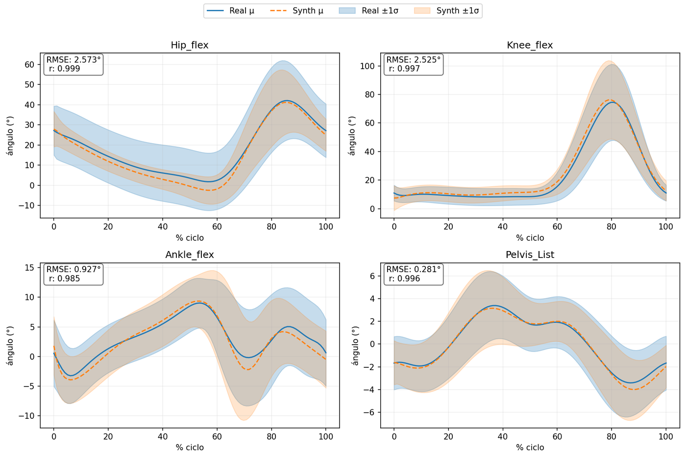
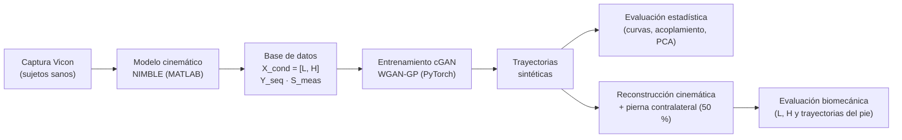
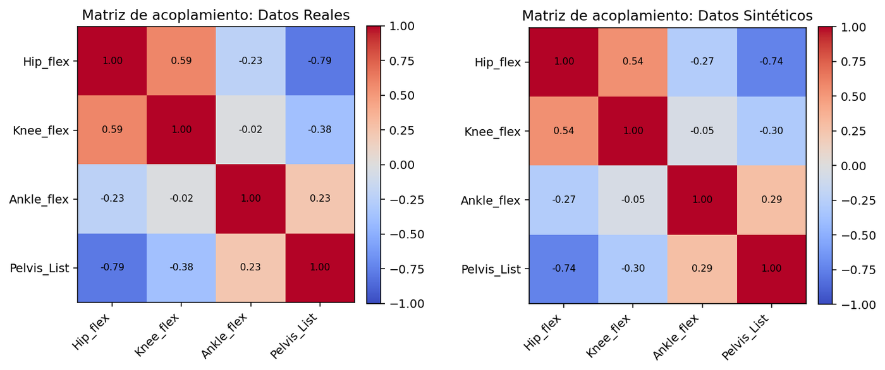
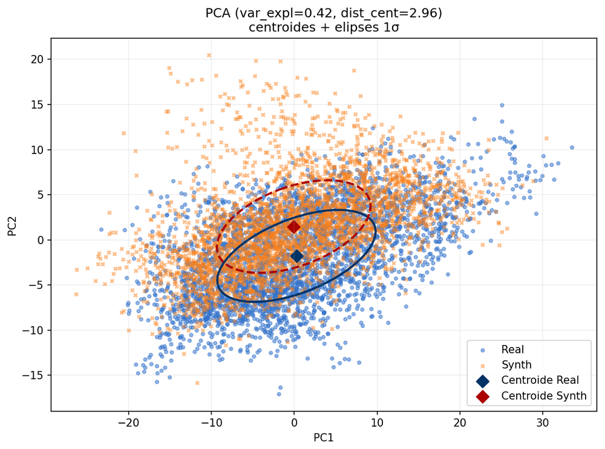
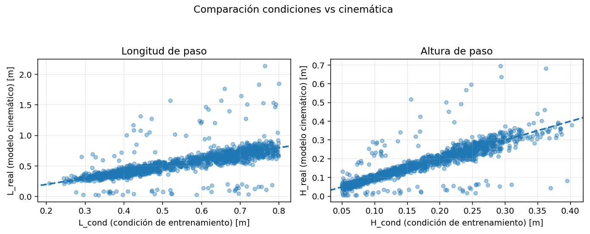
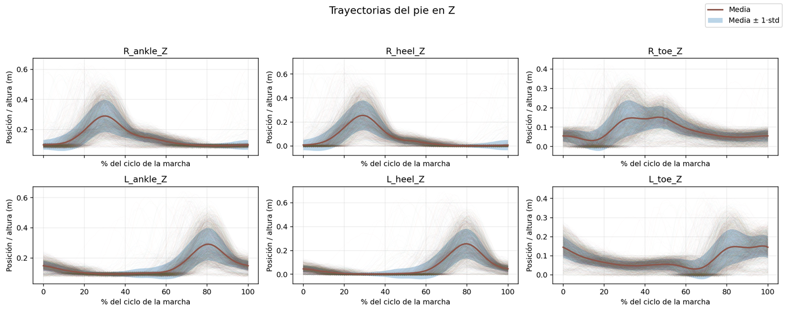

<h1 align="center">Planificación adaptativa de trayectorias articulares para exoesqueletos de rehabilitación mediante IA</h1>

<p align="center">
  <strong>Red generativa antagónica condicionada (cGAN) que sintetiza ciclos de marcha a partir de metas clínicas</strong>
</p>

<p align="center">
  Trabajo Fin de Grado · Grado en Ingeniería Biomédica · Universidad Rey Juan Carlos (Escuela de Ingeniería de Fuenlabrada)<br>
  Curso 2025/2026 · Enmarcado en el proyecto de rehabilitación robótica <strong>NIMBLE</strong>
</p>

<p align="center">
  
  
  
  
</p>

<p align="center">
  📄 <a href="https://hdl.handle.net/10115/394798"><strong>Leer la memoria completa en el repositorio de la URJC (BURJC Digital)</strong></a>
</p>

---

## Resumen

La rehabilitación de la marcha asistida por robot necesita **trayectorias articulares** que cumplan tres condiciones:

- Que sean biomecánicamente coherentes.
- Que se adapten a cada paciente.
- Que se puedan controlar mediante **metas clínicas**, como la longitud y la altura del paso.

En el proyecto **NIMBLE** se desarrolla un exoesqueleto de miembro inferior con actuador pélvico por cables y soporte parcial de peso. Su planificador original se basaba en algoritmos evolutivos: generaba trayectorias de calidad, pero tardaba demasiado para usarse en tiempo real.

En este TFG se diseña, entrena y evalúa una **cGAN de tipo Wasserstein con penalización por gradiente (WGAN-GP)**:

- **Entrada:** la longitud de paso (L), la altura de paso (H) y la antropometría del usuario.
- **Salida:** un ciclo completo de flexión de **cadera, rodilla y tobillo** y de **inclinación pélvica**.

Son los grados de libertad que mueve el exoesqueleto de NIMBLE.

## Resultados principales

| | Resultado |
|---|---|
| ✅ **Forma del ciclo** | Reproduce con alta fidelidad la curva media y la variabilidad de cadera, rodilla y pelvis (r ≥ 0,98 en entrenamiento) |
| ✅ **Coordinación** | Mantiene el acoplamiento entre articulaciones: la diferencia media con los datos reales es solo \|Δ\| ≈ 0,04 |
| ✅ **Altura de paso** | Se ajusta bien a la meta clínica: error mediano de 1 cm en entrenamiento y 2,8 cm en validación |
| ⚠️ **Longitud de paso** | Se degrada más con datos nuevos: error mediano de 3,5 cm en entrenamiento y 6,3 cm en validación |
| ⚠️ **Tobillo** | Es la articulación más difícil: su error relativo sube al 19,5 % en validación |
| ⚠️ **Cierre del ciclo** | No todas las secuencias cierran bien el ciclo: se descarta el 51 % en entrenamiento y el 38 % en validación |

<details>
<summary><strong>Métricas por articulación (curvas promedio real vs. sintética)</strong></summary>

| Articulación | RMSE entren. | %RMSE entren. | r entren. | RMSE valid. | %RMSE valid. | r valid. |
|---|---:|---:|---:|---:|---:|---:|
| Flexión de cadera | 2,57° | 6,39 % | 0,999 | 3,83° | 9,52 % | 0,996 |
| Flexión de rodilla | 2,53° | 3,81 % | 0,997 | 2,11° | 3,21 % | 0,996 |
| Flexión de tobillo | 0,93° | 7,55 % | 0,985 | 1,71° | 19,52 % | 0,909 |
| Inclinación pélvica | 0,28° | 4,12 % | 0,996 | 0,57° | 9,13 % | 0,976 |

%RMSE = RMSE relativo al rango de movimiento de cada articulación.

</details>

<p align="center">
  <br>
  <em>Curvas promedio reales (línea continua) frente a sintéticas (discontinua), con bandas de ±1σ. Conjunto de entrenamiento.</em>
</p>

## Cómo funciona



### Datos

Proceden de ensayos con sujetos sanos del proyecto NIMBLE, capturados con un sistema **Vicon** de 10 cámaras. Sobre esos datos se hace lo siguiente:

1. **Normalización:** cada paso se ajusta a **100 muestras**, empezando en el contacto inicial del talón.
2. **Unificación de piernas:** se usan ambas piernas. En los pasos de la pierna izquierda se invierte el signo de la inclinación pélvica para que todos los pasos sean comparables.
3. **Filtrado clínico:** solo se conservan los pasos útiles para terapia, con L ≤ 0,80 m y 0,05 m ≤ H ≤ 0,45 m.
4. **Formato final:** cada muestra queda como `(X_cond, Y_seq, S_meas)`:
   - `X_cond = [L, H]`: las metas clínicas, en metros.
   - `Y_seq ∈ ℝ^(100×4)`: los ángulos de cadera, rodilla, tobillo y pelvis, en grados.
   - `S_meas ∈ ℝ⁶`: las medidas del sujeto (altura, fémur, tibia, longitud de pierna, ancho de rodilla y ancho de pelvis).

### Arquitectura

| Componente | Diseño |
|---|---|
| **Generador (G)** | MLP de condiciones → concatenación con ruido **AR(1)** temporalmente correlacionado → **2 capas GRU** → cabezas MLP independientes por articulación |
| **Crítico (C)** | **Bi-GRU** sobre la secuencia + condiciones → promedio temporal → MLP que da una puntuación de realismo (distancia de Wasserstein) |
| **Predictor auxiliar (P)** | Conv1D + MLP que estima (L̂, Ĥ) a partir de la secuencia generada, para comprobar que respeta las metas pedidas |

**Pérdida del generador**

$$\mathcal{L}_G = \alpha_{adv}\,\mathcal{L}_{adv} + \alpha_{fm}\,\mathcal{L}_{FM} + \alpha_{bio}\,\mathcal{L}_{bio} + \alpha_{cons}\,\mathcal{L}_{cons}$$

- **Adversarial:** premia que el crítico tome las secuencias generadas por reales.
- **Feature matching:** obliga a que las activaciones internas del crítico sean parecidas para datos reales y sintéticos.
- **Biomecánica:** penaliza los cambios bruscos (suavidad, curvatura y *jerk*) y que el ciclo no cierre.
- **Consistencia:** penaliza que el predictor P estime una L y una H distintas de las pedidas.

**Entrenamiento**

- División de los datos: 90 % entrenamiento y 10 % validación, con normalización z-score.
- Lotes de 64 muestras, con 3 actualizaciones del crítico por cada una del generador y λ_GP = 10.
- Adam con tasa de aprendizaje de 1e-4 para G y 8e-5 para C.
- Parada temprana según el MSE de validación, guardando el mejor *checkpoint*.

## Resultados visuales

<table>
  <p align="center">
    
    <br>
    <em>Izquierda: acoplamiento interarticular, real vs. sintético. Derecha: ciclos reales y sintéticos proyectados en el plano PCA.</em>
  </p>
</table>

<p align="center">
  <br>
  <em>Metas clínicas pedidas (eje X) frente a las reconstruidas con el modelo cinemático (eje Y). La línea discontinua es y = x.</em>
</p>

<p align="center">
  <br>
  <em>Trayectorias verticales del tobillo, talón y punta del pie reconstruidas a partir de las secuencias sintéticas.</em>
</p>

## Estructura del repositorio

| Archivo | Lenguaje | Función |
|---|---|---|
| `build_DB_from_VICON.m` | MATLAB | Construye la base de datos de entrenamiento a partir de los datos Vicon |
| `LH_from_VICON_angles.m` | MATLAB | Extrae y normaliza un ciclo y calcula L y H con el modelo cinemático |
| `build_stepAng_from_Y.m` | MATLAB | Remuestrea un ciclo a N puntos y prepara la estructura `stepAng` |
| `add_contralateral_50.m` | MATLAB | Genera la pierna contralateral aplicando un desfase del 50 % |
| `train_cgan.py` | Python | Define y entrena la cGAN (G, C y P), con *checkpoints* y parada temprana |
| `sample_cgan.py` | Python | Genera trayectorias sintéticas con un modelo entrenado |
| `eval_estadistica.py` | Python | Evaluación estadística: curvas promedio, acoplamiento, PCA e informe |
| `build_DB_from_GAN.m` | MATLAB | Reconstruye las secuencias sintéticas con el modelo cinemático (L, H y pie) |
| `LH_from_Yseq.m` / `LH_from_Y_single.m` | MATLAB | Aplican el modelo cinemático ciclo a ciclo |
| `eval_clinica.py` | Python | Evaluación biomecánica: L y H pedidas frente a reconstruidas, y trayectorias del pie |

## Uso

> ⚠️ **Los datos y el modelo cinemático no están incluidos.** Los datos Vicon y las funciones `executeKinematicModel` y `gaitFeatureExtraction` pertenecen al proyecto NIMBLE. Los scripts de MATLAB esperan encontrarlos en las carpetas `../DATABASE` y `../FUNCIONES`.

**Requisitos (Python):** `torch`, `numpy`, `h5py`, `matplotlib`

```bash
pip install -r requirements.txt
```

**1. Construir la base de datos** (en MATLAB): ejecuta `build_DB_from_VICON.m`.

**2. Entrenar la cGAN:**
```bash
python train_cgan.py --mat train_cont.mat --out runs/cgan --epocas 120 --stop_best 20
```

**3. Generar trayectorias sintéticas:**
```bash
python sample_cgan.py --ckpt runs/cgan/ckpt_best.pt --mat train_db_original.mat --out samples
```

**4. Evaluación estadística:**
```bash
python eval_estadistica.py --real_mat train_db_original.mat --synth_mat samples/synthetic_samples.mat --out compare_report
```

**5. Evaluación biomecánica:** ejecuta `build_DB_from_GAN.m` en MATLAB y después:
```bash
python eval_clinica.py --mat db_validacion_w_foot.mat --out eval_LH
```

## Trabajo futuro

- **Periodicidad:** reforzar el cierre del ciclo, por ejemplo integrando el modelo cinemático en el entrenamiento o usando arquitecturas que encadenen ciclos sucesivos.
- **Longitud de paso:** mejorar su control en zonas del espacio clínico alejadas de los datos de entrenamiento, por ejemplo con un predictor auxiliar más preciso.
- **Aplicaciones:** ampliar bases de datos, simular escenarios difíciles de registrar y prototipar rápidamente controladores de rehabilitación.

## Cómo citar

Guerrero Sancho, M. (2025). *Planificación adaptativa de trayectorias articulares para exoesqueleto de rehabilitación motora mediante inteligencia artificial* [Trabajo Fin de Grado, Universidad Rey Juan Carlos]. BURJC Digital. https://hdl.handle.net/10115/394798

```bibtex
@thesis{guerrero2025tfg,
  author      = {Guerrero Sancho, Manuel},
  title       = {Planificación adaptativa de trayectorias articulares para exoesqueleto de rehabilitación motora mediante inteligencia artificial},
  type        = {Trabajo Fin de Grado},
  institution = {Universidad Rey Juan Carlos},
  year        = {2025},
  url         = {https://hdl.handle.net/10115/394798}
}
```

## Autor

**Manuel Guerrero Sancho** · [@M-Guerrero](https://github.com/M-Guerrero)

Tutor: **Juan Carballeira López**

Grado en Ingeniería Biomédica, Universidad Rey Juan Carlos.
